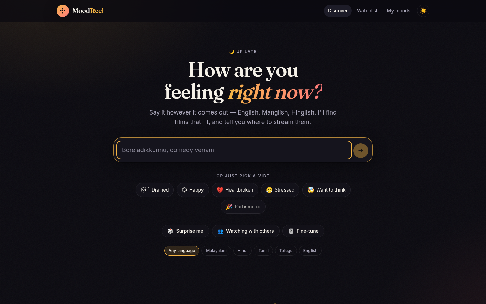
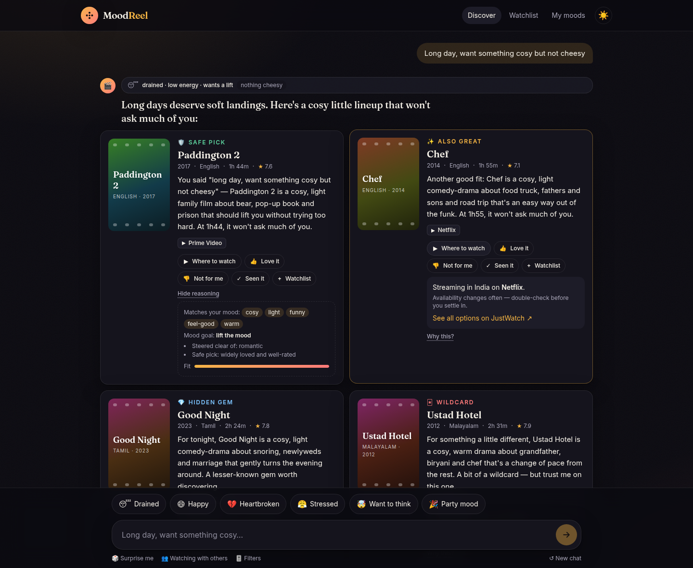
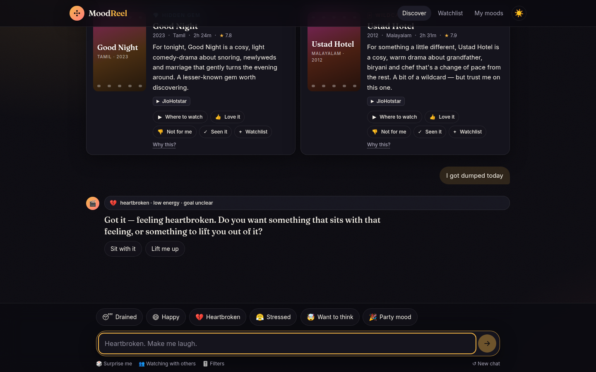
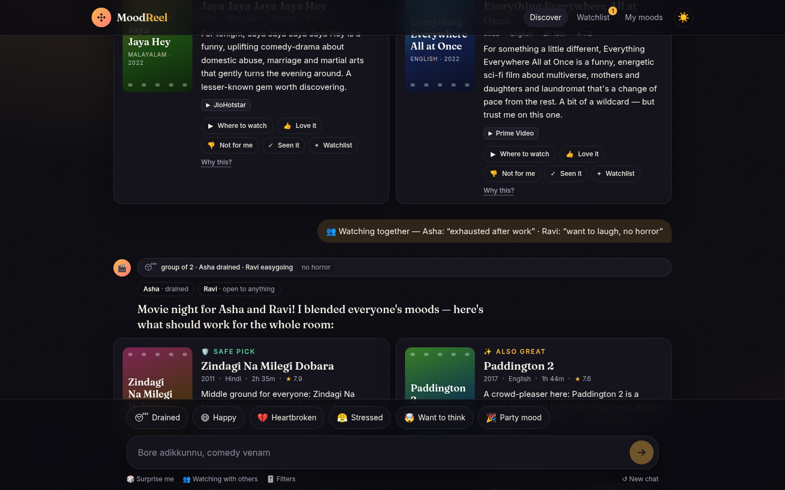
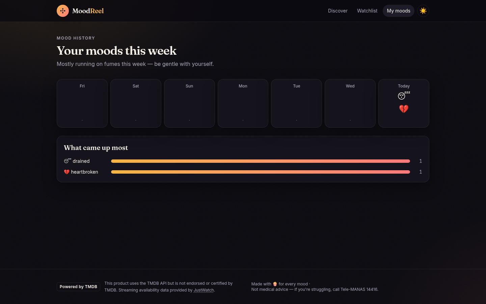
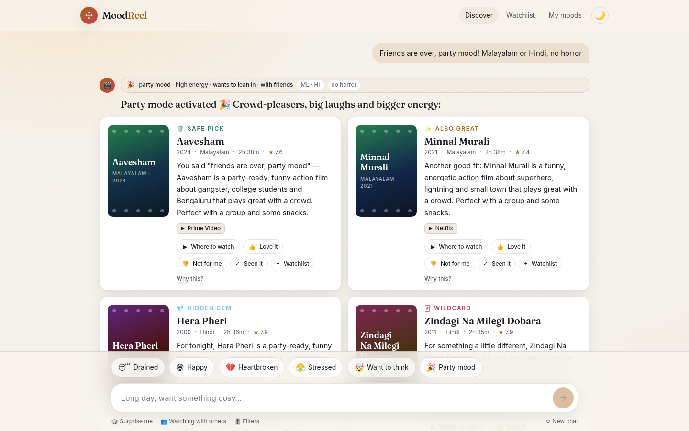
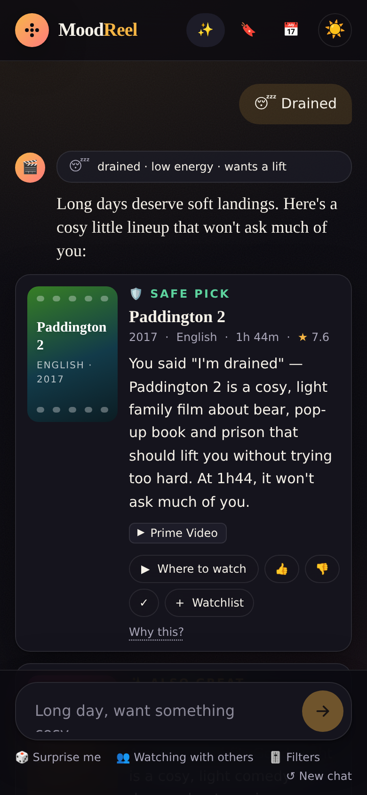
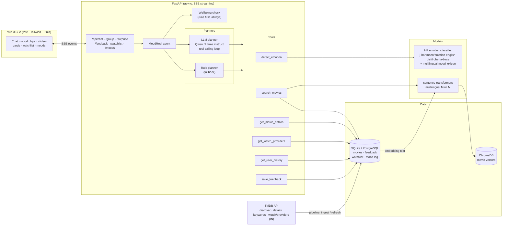
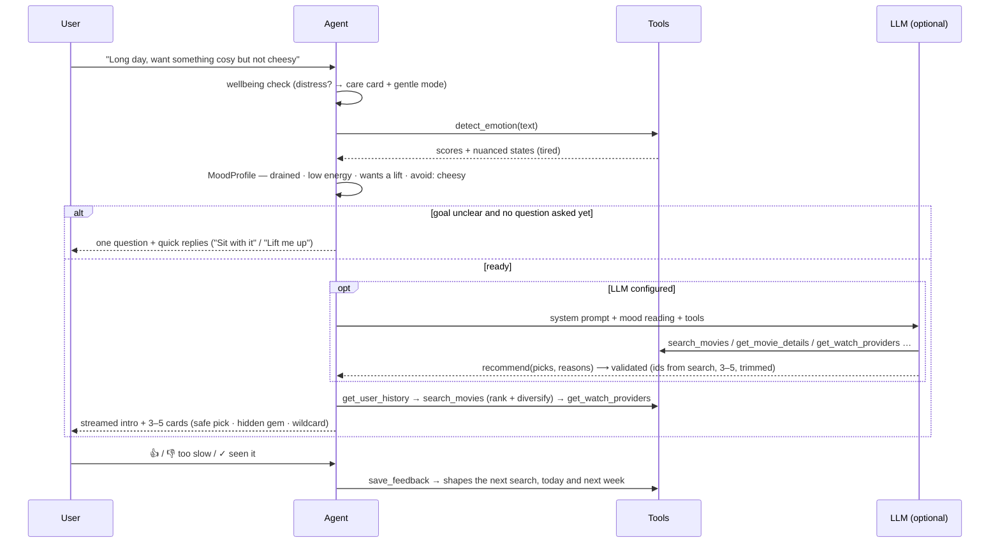

# 🎬 MoodReel

**Tell it how you feel. Get films that fit, with where to stream them in India.**

MoodReel is a conversational movie recommender. You describe your mood in your own words, in English or in
Manglish, Hinglish or Tanglish. An AI agent works out what you're feeling and what you want from tonight,
then suggests 3–5 Malayalam, Hindi, Tamil, Telugu or English films. Each one comes with a short reason
tied to what you said.



---

## The problem

Streaming apps organise films by **genre and popularity**, but people choose films by **feeling**:
*"long day, want something cosy but not cheesy"*, *"just got dumped, make me laugh"*,
*"bore adikkunnu, oru Malayalam comedy"*. Turning a mood into a genre filter is left to the viewer.
That's the endless scroll. It's worse in India, where the film you want might be on any of five
services and in any of five languages.

## How MoodReel differs from Netflix / Prime

| | Netflix / Prime Video | **MoodReel** |
|---|---|---|
| Starting point | Rows of genres and "Top 10" | *"How are you feeling right now?"* in free text or one tap |
| Catalogue | Only that service's library | **Across platforms**: Netflix, Prime Video, JioHotstar, SonyLIV, ZEE5, Sun NXT… |
| Languages | Indian films are a regional row | **Indian-first**: Malayalam, Hindi, Tamil, Telugu treated on par with English; understands code-mixed input |
| Personalisation | Needs weeks of watch history | **From the first session**: 👍/👎/"seen it"/"too slow" change the very next answer and carry across sessions |
| Transparency | "Because you watched X" | Every pick has a **human reason tied to your words**, plus an expandable *Why this?* |
| Variety | Many near-identical titles | Deliberately **diverse sets**: a safe pick, a hidden gem, a wildcard |
| Watching together | One profile at a time | **Group mode** blends everyone's mood |
| Wellbeing | — | Notices serious distress, responds with care, keeps picks gentle, shares helplines |

---

## Features

- **Emotion-understanding agent.** It reads a primary and a secondary emotion, intensity, energy, and
  whether you want to *stay* in the mood or *shift* it. It also picks up context: who you're watching with,
  how much time you have, languages, and things to avoid.
- **At most one follow-up question,** and only when the mood goal is unclear. One-tap answers: *Sit with it* / *Lift me up*.
- **Two ways in.** Free-text chat, or emoji mood chips (😴 Drained · 😄 Happy · 💔 Heartbroken · 😤 Stressed · 🤯 Want to think · 🎉 Party mood).
- **Optional sliders** for energy and *stay in mood ↔ change my mood*. A language filter: Malayalam / Hindi / Tamil / Telugu / English / Any.
- **Animated recommendation cards.** Each shows a poster, runtime, rating, streaming badges and a reason,
  with ▶ Where to watch · 👍 Love it · 👎 Not for me (too slow / too heavy) · ✓ Seen it · + Watchlist.
- **Refinements in chat:** *"something else"*, *"seen them"*, *"shorter"*, *"lighter"*, *"too slow"*.
- **🎲 Surprise me** (drawn from your taste profile) and **👥 Watching with others** (group mode).
- **Watchlist** and **Your moods this week**.
- **Dark cinematic theme** with a light theme. Skeleton loaders, typing indicator, streaming responses, reduced-motion support.
- **Accessible:** keyboard navigable, visible focus, live region for chat, alt text on posters, high contrast.

| Recommendations with *Why this?* and *Where to watch* | One gentle follow-up, only when needed |
|---|---|
|  |  |
| **Group mode** | **Your moods this week** |
|  |  |
| **Light theme** | **Mobile** |
|  |  |

> Screenshots use the offline seed catalogue. It has no TMDB posters, so the app draws generated poster
> art. With a TMDB key, real posters and live JustWatch providers appear.

---

## Architecture



### One turn of the agent



### How it works

**1. Understanding the mood** (`backend/moodreel/emotion/`)
- The HF classifier (`j-hartmann/emotion-english-distilroberta-base`) gives a fast first signal over seven base emotions.
- A mood lexicon adds nuance the classifier can't see (*tired* vs *sad* vs *lonely*, *heartbroken*, *bored*,
  *curious*…) and covers Indian phrasing: *mood off*, *thak gaya*, *bore adikkunnu*, *sankadam*,
  *santhosham*, *tension*, and a few native-script words.
- Rules turn this into a `MoodProfile`:
  - primary and secondary emotion, intensity and energy
  - **goal**, from explicit cues (*"cheer me up"* → shift, *"want a good cry"* → stay), the slider,
    requested tones, or a sensible default; still unclear → ask once
  - context: company, time, languages, things to avoid (with negation: *"no horror"*, *"nothing slow"*), target tones
- When an LLM is configured, it refines this reading. Its values are validated before use.

**2. Finding films** (`backend/moodreel/search/`, `agent/ranking.py`)
- Each movie is embedded from *overview + genres + keywords + tone descriptors*. TMDB doesn't say how a
  film *feels*, so tones such as `cosy`, `bittersweet`, `tense`, `mind-bending` are derived from genres and keywords.
- **Score** = semantic similarity + tone fit with the mood + quality + learned taste + context
  (energy, company, explicit asks), minus clashes with the goal (no romance for heartbroken-but-wants-a-lift).
- Hard filters: language, things to avoid, runtime, already seen or disliked. Constraints loosen with a
  note when nothing fits.
- **Diversity:** one *safe pick* (well-known, well-rated), one *hidden gem* (highly rated, under-watched,
  thresholds set per language so regional films aren't penalised), one *wildcard* (deliberately different),
  then MMR for the rest.

**3. Explaining** (`agent/reasons.py`)
- Reasons quote or echo the user's words and name the tones that matched, the mood goal and a practical
  note (runtime on a low-energy night, "a lesser-known gem").
- *Why this?* shows the matched tones, filters applied, slot rationale and a fit score.

**4. Learning** (`agent/memory.py`)
- Feedback updates per-user tone and genre affinities: *loved* +, *disliked* −, *too slow* → penalise
  `slow-burn`, *too heavy* → penalise dark or intense tones. *Seen* is excluded.
- The effect is immediate (same session) and persistent (stored in SQL).

**5. Wellbeing** (`emotion/safety.py`)
- Runs before any model, so it can't be skipped.
- On signs of serious distress, MoodReel responds with care. It doesn't diagnose. It suggests reaching out
  to someone trusted or **Tele-MANAS (14416)**, gives 112 for emergencies, and keeps the picks gentle:
  three comforting films, nothing dark, violent or horror. It never asks a follow-up question in that state.

### Graceful degradation

Every heavy component has an `auto` mode and a lightweight fallback, so the app runs on a laptop, in CI or on a free tier:

| Component | Full stack | Fallback (no downloads) |
|---|---|---|
| Emotion | HF `emotion-english-distilroberta-base` + lexicon | Lexicon only |
| Embeddings | `sentence-transformers` multilingual MiniLM | Feature-hashing embedder with mood-synonym expansion |
| Vector store | ChromaDB (persistent) | In-memory numpy |
| Planner | LLM tool-calling loop (HF Inference or local `transformers`) | Deterministic rule planner over the same tools |
| Catalogue | TMDB pipeline | Curated 119-film seed catalogue |

If the LLM errors, times out, loops or returns invalid picks, the agent falls back to the rule planner
within the same request. `/api/health` reports which engines are active.

---

## Quick start

**Requirements:** Python 3.10+ and Node 22+ (Vite 8).

```bash
git clone <this repo> && cd Movie_Recommendation_agent
cp .env.example .env                 # optional - everything works without keys

# Backend
cd backend
python -m venv .venv && source .venv/bin/activate
pip install -r requirements-dev.txt  # core + tests (fallback engines)
python -m moodreel.data.pipeline seed   # curated catalogue + vector index (auto-runs on first start too)
uvicorn moodreel.api.main:app --reload  # http://localhost:8000/docs

# Frontend (new terminal)
cd frontend
npm install
npm run dev                          # http://localhost:5173 (proxies /api to :8000)
```

**Talk to the agent in your terminal** (milestone 3's CLI test):

```bash
cd backend
python -m moodreel.agent.cli --verbose            # logs every agent step / tool call
python -m moodreel.agent.cli --lang ml ta
python -m moodreel.agent.cli --group "Asha:exhausted" "Ravi:want to laugh, no horror"
```

**Or run everything in one container:** `docker compose up --build` → http://localhost:7860

### Enable the full AI stack

```bash
cd backend
pip install -r requirements-ml.txt   # torch (CPU), transformers, sentence-transformers, chromadb, huggingface_hub
python -m moodreel.search.index      # re-embed the catalogue with sentence-transformers
```

Then in `.env`:

```bash
# LLM planner via Hugging Face Inference Providers (no GPU needed)
LLM_BACKEND=hf_inference
HF_TOKEN=hf_...
LLM_MODEL=Qwen/Qwen2.5-1.5B-Instruct   # or a larger Qwen / Llama instruct model

# ...or run the model locally (GPU recommended)
LLM_BACKEND=local
```

### Live data from TMDB

```bash
# TMDB_API_KEY in .env, then:
python -m moodreel.data.pipeline ingest --pages 5 --replace-seed   # /discover/movie per language (ml, hi, ta, te, en)
python -m moodreel.data.pipeline refresh --days 45                 # new releases + provider changes
python -m moodreel.data.pipeline stats
```

For each discovered film the pipeline calls `/movie/{id}?append_to_response=keywords,watch/providers`. It
normalises provider names (*Disney+ Hotstar* → *JioHotstar*), keeps India (`IN`) availability, derives
tones and content flags, upserts into SQL and rebuilds the vector index. It is rate-limited (token
bucket) and retries 429/5xx with backoff.

---

## API

Interactive docs at `/docs`. The streaming endpoints send Server-Sent Events: `session`, `status`, `mood`,
`care`, `delta`, `question`, `recommendations`, `done`, `error`. Each has a `/sync` JSON twin.

| Method | Path | Purpose |
|---|---|---|
| `POST` | `/api/chat` | Chat turn: `{user_id, session_id?, message?, chip?, languages[], energy?, mood_shift?}` |
| `POST` | `/api/group` | Group mode: `{user_id, members:[{name, mood}], languages[]}` |
| `POST` | `/api/surprise` | Surprise me |
| `POST` | `/api/feedback` | `{user_id, movie_id, signal: loved\|disliked\|seen\|too_slow\|too_heavy}` |
| `GET/POST/DELETE` | `/api/watchlist` | Watchlist |
| `GET` | `/api/moods?user_id&days=7` | Mood history and counts |
| `GET` | `/api/movies/{id}` · `/api/users/{id}/history` | Details · taste profile |
| `GET` | `/api/health` · `/api/meta` | Engines in use · chips, languages, attribution |

---

## Evaluation

There are two prompt sets:

- **Dev set**, [`prompts.json`](backend/eval/prompts.json), with **30 prompts**: 8 everyday,
  7 Indian / code-mixed (*"Bore adikkunnu, oru nalla Malayalam comedy venam"*), 4 group, 4 vague
  (*"idk"*, *"meh"*) and 7 edge cases (distress, contradictory moods, emoji-only, impossible constraints).
  The rules were developed against this set.
- **Held-out set**, [`heldout.json`](backend/eval/heldout.json), with **15 new prompts** written and scored
  *before* the stage-2 fixes, so they show how the rules cope with input they weren't tuned on.

[`run_eval.py`](backend/eval/run_eval.py) plays each conversation, answering the follow-up when one is
asked, and scores it:

| Metric | What it measures |
|---|---|
| Understanding | Primary emotion, goal, company and language read correctly |
| Relevance | Share of picks whose tones fit the expected mood *and* respect hard constraints |
| Constraints | Share of picks respecting language / avoid / runtime |
| Diversity | 1 − mean pairwise similarity of the set (genres, tones, language) |
| Reason quality | Echoes the user's words, 1–2 sentences, names a concrete tone or genre, not clinical, not repetitive |
| Behaviour | ≤ 1 follow-up, asked when expected, care shown on distress, 3–5 picks |

```bash
cd backend
python -m eval.run_eval                                   # dev set   -> eval/results.md
python -m eval.run_eval --prompts eval/heldout.json \
                        --out eval/heldout_results.md      # held-out  -> eval/heldout_results.md
```

CI ([`.github/workflows/ci.yml`](.github/workflows/ci.yml)) runs both sets on pull requests and pushes to `main`, and fails if relevance drops below 0.90 (dev) or 0.85 (held-out).

**Results:** fallback stack, 119-film seed catalogue. Per-prompt tables are in
[`results.md`](backend/eval/results.md), [`heldout_results.md`](backend/eval/heldout_results.md) and
[`heldout_baseline.md`](backend/eval/heldout_baseline.md).

| Set | Understanding | Relevance | Constraints | Diversity | Reason quality | Behaviour |
|---|---|---|---|---|---|---|
| Dev, before stage 2 | 1.00 | 0.91 | 0.98 | 0.67 | 0.91 | 1.00 |
| Dev, now | 1.00 | 0.99 | 1.00 | 0.67 | 0.91 | 1.00 |
| **Held-out, first blind run** | **0.78** | **0.85** | **0.92** | **0.68** | **0.91** | **0.98** |
| Held-out, now | 1.00 | 0.93 | 1.00 | 0.68 | 0.91 | 1.00 |

**Read these numbers with care.**
- **The blind held-out run is the honest generalisation number.** Its misses (grief and interview-anxiety
  vocabulary, "2-hour" runtimes, a group asking for horror, and a missed distress phrase) were then fixed,
  so the "Held-out, now" row is no longer blind. A fresh held-out set is needed for the next round.
- One dev expectation changed in stage 2: *"no gore"* now excludes gory films rather than every violent
  film (i05). That reading is more faithful to what the user said.
- The metrics are heuristics. Human ratings or an LLM judge for reason quality are still to do.

**Fixed in stage 2:**
- Explicit requests decide the mood goal. *"Scared… but I want a horror movie, bring it on"* now gets horror.
- When someone asks for a genre, the safe / gem / wildcard slots are chosen *within* that genre.
- *"anything but X"* and *"except X"* are understood as avoids.
- Kid-safe cues (*kids*, *animated*, *wholesome*) rule out violence and horror.
- *"No gore"* is handled separately from *"no violence"*.
- Requests for something light now penalise heavy films.
- Runtimes like *"2-hour"* and *"two hours"* are parsed.
- Group mode carries each person's explicit requests, unless someone else vetoes them.
- When an ask can't be met, the agent says so: *"Honest heads-up: I couldn't find a Telugu scary film that
  fits all your filters…"*
- **Safety:** passive-ideation phrases such as *"I don't want to be here anymore"* now trigger the care
  response. The blind held-out run is where this gap showed up.

**Still open:**
- **h06** *"family padam with amma"* includes *Drishyam*. Family viewing with adults doesn't rule out tense
  crime dramas; whether it should is a product call.
- **h11, h15**: the seed catalogue has only 2 Malayalam horror films and few English thrillers under two
  hours, so sets get padded. The TMDB catalogue should fix this.

---

## Testing

```bash
cd backend && pytest          # 77 tests: pipeline (mocked TMDB), tools, emotion & safety, agent loop, API
cd backend && ruff check . && ruff format --check .
cd frontend && npm test       # SSE parser & formatting
cd frontend && npm run build  # type-check (vue-tsc) + production build
```

The agent-loop integration tests drive the **LLM planner with a scripted fake model**. They check:

- tool calls are executed and fed back
- hallucinated movie ids are dropped
- reasons are trimmed to two sentences
- a second follow-up question is refused
- the planner falls back to rules when the model errors or never finishes

---

## Project structure

```
backend/
  moodreel/
    config.py            # settings (.env)
    db.py                # SQLAlchemy models: movies, feedback, watchlist, mood_log
    data/                # TMDB client, normaliser, tone derivation, pipeline CLI, seed_movies.json
    search/              # embedders, vector stores (Chroma / memory), catalogue index
    emotion/             # classifier, lexicon, MoodProfile analysis, group blending, safety
    agent/               # agent loop, LLM backends, prompts, tools, ranking, reasons, memory, refine, CLI
    api/main.py          # FastAPI app (SSE), optional SPA serving
  eval/                  # dev (30) + held-out (15) prompt sets, scorer, results
  tests/
frontend/
  src/
    api/                 # typed client + SSE streaming
    stores/              # Pinia: user prefs, chat, watchlist
    components/          # cards, chips, composer, sliders, group dialog, care card…
    views/               # Discover, Watchlist, My moods
Dockerfile               # single container (UI + API) for Hugging Face Spaces
backend/Dockerfile       # API only (Render etc.)
render.yaml · docker-compose.yml · frontend/vercel.json · frontend/netlify.toml
docs/deploy.md           # deployment guide
```

## Deployment

See **[docs/deploy.md](docs/deploy.md)**:

- **Hugging Face Spaces:** the root `Dockerfile` serves the UI and API on port 7860.
- **Render:** `render.yaml` deploys the API.
- **Vercel / Netlify:** deploy the UI with `VITE_API_BASE_URL` pointing at the API.
- Scheduled data refresh and PostgreSQL.

## Limitations and roadmap

- **Seed data is indicative.** Ratings, vote counts and streaming availability in `seed_movies.json` are
  approximate. Run the TMDB pipeline for live data.
- **Sessions live in memory.** The session store is in-process with a TTL; use Redis to run several workers.
  User feedback, watchlist and mood history are in SQL.
- **Not yet:** a fresh held-out eval set, human ratings or an LLM judge for reason quality, and testing with
  the full Hugging Face stack and live TMDB data.
- **Planned:** user accounts (identity is an anonymous browser id today), deep links into each streaming app, and more Indian languages (Kannada, Bengali, Marathi).

## Attribution

This product uses the TMDB API but is not endorsed or certified by TMDB.
Streaming availability data is provided by JustWatch via TMDB. Both are credited in the app footer as
their terms require.

MoodReel is not a mental-health service. If you're struggling, please talk to someone you trust or call
**Tele-MANAS at 14416** (India, 24×7, free). In an emergency, call **112**.
